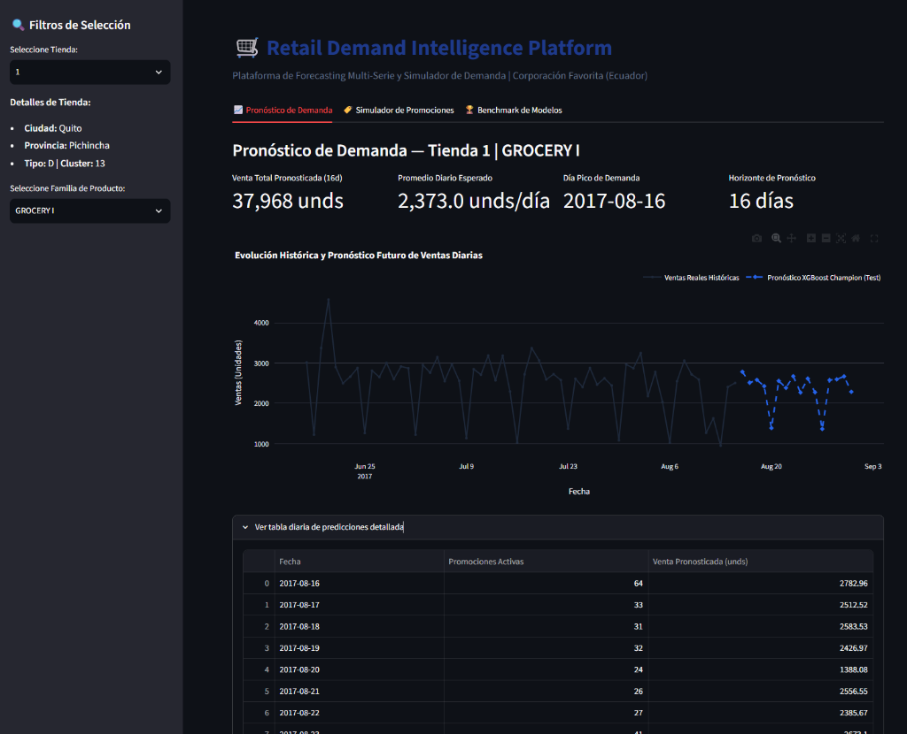

# 📖 Manual de Usuario — Retail Demand Intelligence Platform

Bienvenido al manual de usuario oficial de la **Retail Demand Intelligence Platform**, una aplicación analítica e interactiva diseñada para la toma de decisiones estratégicas de abastecimiento, planificación de inventarios y simulación de promociones en retail (Corporación Favorita, Ecuador).



---

## 🎯 1. Propósito de la Aplicación

La plataforma permite a **Gerentes de Tienda**, **Planificadores de Demanda (Demand Planners)** y **Líderes de Cadena de Suministro (Supply Chain)**:
1. **Visualizar el pronóstico de ventas diarias** para un horizonte de 16 días ($t+1$ a $t+16$) a nivel granular de **Tienda $\times$ Familia de Producto**.
2. **Identificar días pico y valles de demanda** para evitar roturas de stock (*stockouts*) o sobreabastecimiento (*overstocking*).
3. **Simular escenarios de impacto promocional** antes de activar campañas de marketing o descuentos.
4. **Auditar el rendimiento técnico del modelo de Machine Learning** frente a modelos heurísticos tradicionales.

---

## 🚀 2. Cómo Iniciar la Aplicación

### Opción A: Ejecución Local con Python
Abre tu terminal en la raíz del proyecto y ejecuta:
```bash
# Iniciar con streamlit directamente
streamlit run dashboards/app.py

# O utilizando el comando automatizado del Makefile
make dashboard
```
La aplicación se abrirá automáticamente en tu navegador en: `http://localhost:8501`

### Opción B: Ejecución con Docker Compose
```bash
docker compose up --build -d
```
Accede al Dashboard en: `http://localhost:8501` y a la documentación de la API en `http://localhost:8000/docs`.

---

## 🖥️ 3. Guía de Uso de la Interfaz

La aplicación se compone de una **Barra Lateral de Filtros (Sidebar)** y **Tres Pestañas Principales**:

```
┌─────────────────────────┬─────────────────────────────────────────────────────────────┐
│ 🔍 FILTROS LATERALES    │ 🛒 Retail Demand Intelligence Platform                      │
│                         │                                                             │
│ • Tienda (1 a 54)       │ [ 📈 Pronóstico ] [ 🏷️ Simulador Promo ] [ 🏆 Benchmark ]    │
│ • Metadatos de Tienda:  ├─────────────────────────────────────────────────────────────┤
│   - Ciudad / Provincia  │ • Tarjetas de KPIs (Venta Total, Promedio, Día Pico)        │
│   - Tipo / Clúster      │ • Gráfico Interactivo de Serie Temporal (Histórico vs Pred) │
│ • Familia de Producto   │ • Tabla Detallada de Predicciones                           │
└─────────────────────────┴─────────────────────────────────────────────────────────────┘
```

---

### 3.1. Barra Lateral de Filtros (Sidebar)
Ubicada en el panel izquierdo, permite segmentar dinámicamente los datos:

1. **Selector de Tienda:** Selecciona cualquiera de las **54 tiendas** de la cadena.
2. **Tarjeta de Metadatos de Tienda:** Muestra en tiempo real:
   - **Ciudad** (ej. *Quito, Guayaquil, Cuenca*).
   - **Provincia / Estado** (ej. *Pichincha, Guayas, Azuay*).
   - **Tipo de Tienda** (*A, B, C, D, E* según el formato de tienda: hipermercado, supermercado, etc.).
   - **Clúster** (agrupación predefinida de tiendas con patrones homogéneos).
3. **Selector de Familia de Producto:** Menú desplegable con las **33 categorías** disponibles (ej. `GROCERY I`, `BEVERAGES`, `CLEANING`, `DAIRY`, `PRODUCE`, `MEATS`, etc.).

---

### 3.2. Pestaña 1: 📈 Pronóstico de Demanda

Esta es la vista operativa principal para el seguimiento de ventas:

#### A. Tarjetas de Indicadores Clave (KPI Cards)
* **Venta Total Pronosticada (16d):** Volumen acumulado de unidades proyectadas para los próximos 16 días (ej. `37,968 unds`).
* **Promedio Diario Esperado:** Ritmo diario medio de rotación de producto (ej. `2,373.0 unds/día`).
* **Día Pico de Demanda:** Fecha exacta donde se proyecta la mayor afluencia y volumen de compra (ej. `2017-08-16`).
* **Horizonte de Pronóstico:** Duración del ciclo de inferencia (`16 días`).

#### B. Gráfico Interactivo de Series Temporales (Plotly)
* **Línea Negra Sólida:** Ventas reales históricas de los últimos 60 días.
* **Línea Azul Discontinua con Diamantes:** Predicción generada por el modelo campeón **XGBoost Global Multi-Serie**.
* **Interactividad:**
  - Pasa el cursor sobre cualquier punto para ver el valor exacto de la fecha.
  - Usa la barra de herramientas superior derecha para hacer zoom, paneo o descargar la gráfica en formato PNG.

#### C. Tabla de Detalle Diario
* Haz clic en el acordeón *"Ver tabla diaria de predicciones detallada"* para inspeccionar:
  - `Fecha`: Día exacto del pronóstico.
  - `Promociones Activas`: Cantidad de artículos con descuento programados para ese día.
  - `Venta Pronosticada (unds)`: Demanda unitaria esperada.

---

### 3.3. Pestaña 2: 🏷️ Simulador de Promociones (Elasticidad & Uplift)

Permite al equipo comercial y de marketing simular el impacto de variar la intensidad promocional:

1. **Slider de Variación Promocional:** Ajusta el porcentaje de cambio en promociones desde **-50%** (reducción de descuentos) hasta **+100%** (duplicar promociones activas).
2. **Cálculo de Demanda Proyectada (Uplift):**
   - Compara las barras grises (*Pronóstico Base*) contra las barras verdes (*Pronóstico Simulado*).
   - Permite estimar si el incremento en volumen de ventas justifica el costo de la oferta antes de activar la campaña.

---

### 3.4. Pestaña 3: 🏆 Benchmark de Modelos & Métricas

Vista diseñada para auditoría técnica y justificación de arquitectura:

* **Tabla Consolidada de Métricas:**
  - $RMSLE$ (*Root Mean Squared Logarithmic Error*): Métrica técnica de optimización.
  - $WAPE (\%)$ (*Weighted Absolute Percentage Error*): Error porcentual ponderado sobre el volumen real (el estándar de retail).
  - $Bias (\%)$: Sesgo direccional de inventario (positivo = sobre-predicción, negativo = sub-predicción).
* **Gráficos Comparativos:**
  - Demuestra visualmente por qué **XGBoost** superó a LightGBM, al Ensamble 50/50 y a los modelos de referencia (*Moving Average 7d*, *Seasonal Naive*, *Naive*).

---

## 💡 4. Buenas Prácticas y Casos de Uso Recomendados

| Rol | Acción en la Plataforma | Beneficio de Negocio |
| :--- | :--- | :--- |
| **Gerente de Tienda** | Consultar el *Día Pico* y el *Promedio Diario* al inicio de semana. | Planificación de personal de reposición en góndolas y horarios de caja. |
| **Planificador de Compras (Supply Chain)** | Exportar la *Venta Total Pronosticada (16d)* de las familias líderes (Top 5 Pareto). | Emisión oportuna de órdenes de compra al centro de distribución para evitar desabastecimiento. |
| **Coordinador de Marketing / Trade** | Probar diferentes niveles en el *Simulador de Promociones* antes de un fin de semana. | Maximizar el retorno de inversión (ROI) de las promociones activas en tienda. |

---

## 🛠️ 5. Soporte y Solución de Problemas

* **Error de conexión o datos no encontrados:** Asegúrate de haber ejecutado previamente `python src/retail_platform/data_engine/pipeline.py` y `python src/retail_platform/features/builder.py`.
* **Puerto en uso (8501):** Puedes especificar otro puerto ejecutando `streamlit run dashboards/app.py --server.port 8502`.
